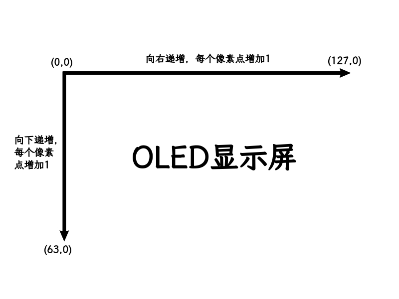

# 如何使用ESP32驱动IIC协议的OLED显示屏

学习完本章教程之后，你会知道如何给IIC屏幕接线、了解一些简单的屏幕运行原理、如何选择构造函数以及在屏幕上显示中文

### 写在前面:我的屏幕是IIC吗？
如果你的屏幕只有4个引脚（**VCC**、**GND**、**SCL**、**SDA**）,那么你的屏幕就是IIC。
其中，各个引脚的作用是:
- **VCC**接在电源引脚上，比如**3V3**和**VIN**上
>连接建议:为了安全，就接在3.3V的**3V3引脚**上，而不是5V的**VIN引脚**
- **GND**接在接地引脚上
>连接建议:就接在**GND引脚**上
- **SCL**是时钟线
>连接建议:最好连接在非“仅输入”引脚(比如**GPIO 34、35、36和39**是仅输入引脚)、非Strapping引脚(比如**GPIO 0、2、12、15引脚**，可能会干扰芯片正常启动)和**非电源以及地线引脚**
- **SDA**是数据线
>连接建议:同**SCL**

### 一、确认屏幕信息
以手边的为例，这次使用的屏幕为:
- 驱动芯片:SSD1306
- 分辨率:128*64
- 制造品牌不明

### 二、安装要使用到的库
1. 在vscode的PIO插件中，找到**蚂蚁图标**，之后点击它;
2. 找到**PIO Home**里的**Open**，打开**Libraries**;
3. 在搜索框里搜索**U8g2**，要找到作者是**oliver**，也就是后面写着**by oliver**;
4. 点击**Add to project**,在**Select a project**中选择你自己的项目后，点击**Add**;
5. 等待一会，库就安装在你的项目中了。

### 三、OLED屏幕像素坐标系

这就是OLED显示屏的坐标系，其中，**左上角**的像素点，坐标为(0,0)，和我们平时学习的平面直角坐标系稍微有些差别，比如向下是增加y坐标而不是减小

### 四、选择构造函数
在对ESP32上的OLED编程时，要确定其在编程时对象的构造函数。
以下是一段构造函数的例子:
**U8G2_SSD1306_128X64_NONAME_F_HW_I2C**
下面我将解释每一个元素是什么意思

|例子中的元素|这是什么？|如何更改？|
|:---|:---|:---|
|U8G2|库的前缀|这个不要改|
|SSD1306|驱动芯片型号|根据屏幕的驱动芯片型号决定，如果是SSD1306,这里就添SSD1306|
|128X64|屏幕的分辨率|根据屏幕分辨率决定，**x**前写大的，**x**后写小的|
|NONAME|屏幕的生产厂商|在此处写上屏幕的生产厂商，如果不知道，就写**NONAME**就可以了|
|F|帧缓冲区模式|如果你用的是ESP32,就用**F**(全帧缓冲区)，渲染更快，但占用内存更大(1024字节)，如果内存不够用，可以尝试**1**(占用128字节内存，渲染最慢)和**2**(占用256字节内存，渲染速度适中)，且**1**和**2**在运行时都会有闪烁|
|HW_I2C|通信接口|**HW_I2C**是**硬件I2C**，性能更好，**在esp32中，可以调用引脚很灵活，可以使用大部分引脚**，但在其他机器中，可能不灵活，固定，这时要用**SW_I2C**,也就是**软件I2C**，在部分机器中，引脚分配比硬件I2C更灵活(比如硬件只有一组引脚且固定，而软件可以有很多组引脚且不固定)，但性能更差，常用于调试和上述“其他机器”固定引脚被占用场景|

### 五、开始编写代码(写一个简单的显示中文“请输入文本”的代码)
1. 引用头文件
```cpp
#include <Arduino.h>
#include <U8g2lib.h> //新使用的u8g2库
#include <Wire.h> //修改I2C引脚所要用到的库
```

2. 定义引脚编号
```cpp
#define I2C_SCL xx //xx处填写SCL连接的引脚编号，比如14
#define I2C_SDA yy //yy处填写SDA连接的引脚编号，比如25
```

3. 创建对象
```cpp
U8G2_SSD1306_128X64_NONAME_F_HW_I2C u8g2(U8G2_R0,U8X8_PIN_NONE); //这里的构造函数选步骤四中适合你的屏幕的构造函数。现在创建了一个对象u8g2(名字不为一),以后对屏幕的操控都要用它
```
**说明:** U8G2_R0是指屏幕不需旋转，这里可以填的数据有：

|可填数据|说明|
|:---|:---|
|U8G2_R0|默认的横向显示|
|U8G2_R1|将屏幕内容顺时针旋转90度|
|U8G2_R2|将屏幕内容旋转180度（上下颠倒）|
|U8G2_R3|将屏幕内容顺时针旋转270度|
|U8G2_MIRROR|不旋转，但内容水平镜像|
|U8G2_MIRROR_VERTICAL|内容垂直镜像（在较新版本如v2.29.x中可用）|

同时，**U8X8_PIN_NONE**指该屏幕**没有复位引脚**，如果有，把引脚编号替换U8X8_PIN_NONE


4. 在steup()函数中准备
```cpp
void setup(){
    Wire.begin(I2C_SDA,I2C_SCL); //这里来规定SDA和SCL的引脚编号是多少
    u8g2.begin(); //开始屏幕的使用
    u8g2.enableUTF8Print(); //提供UTF-8支持
}
```
**说明:** 
- Wire.begin()一定要放在u8g2.begin()的前面，要不然u8g2.begin()内部会调用Wire.begin()使用引脚默认值，导致引脚编号对不上，无法显示，并且这个问题比较难找，写了也不报错，你行可能认为硬件坏了。
- 如果你在屏幕上只打印英文，可以不写enableUTF8Print()，如果你要在屏幕上打印中文，就必须写enableUTF8Print()。

5. 开始写主程序
```cpp
void loop(){
    u8g2.clearBuffer(); //清除缓冲区的内容

    u8g2.setDrawColor(1); //设置打印颜色为亮色(1为亮色，0为暗色(不发光))
    u8g2.setFont(u8g2_font_wqy16_t_gb2312);//设置字体
    u8g2.setCursor(0,18); //设置打印文字时的光标位置
    u8g2.print("请输入文本"); //设置打印内容为“请输入文本”

    u8g2.sendBuffer(); //把缓冲区的内容发送到屏幕上
    delay(5000); //等待5s刷新，避免一直刷新屏幕
}
```
**说明:** 
- 关于**缓冲区:** 把将要在屏幕显示的画面写入缓冲区，就像草稿纸，打好草稿后再显示，使用前用u8g2.clearBuffer()清空缓冲区，在缓冲区写好后，用u8g2.sendBuffer()把缓冲区的图像显示在屏幕上，之前说的**U8G2_SSD1306_128X64_NONAME_F_HW_I2C**中的**F**就是使用1024字节的缓冲区，当缓冲区大小和屏幕相同时，显示速度快且没有闪烁
- 关于**字体:** 使用u8g2.setFont()设置屏幕字体，有很多字形大小不同的字体，可以从浏览器上搜索选择合适的，同时，不是每一个u8g2库都有u8g2_font_wqy16_t_gb2312，如果编译时找不到字体，可以通过库管理器安装
- 关于**光标位置:** 打印文字时要设置光标位置，比如setCursor(x,y)，其中(x,y)是文字的基线位置，不要把光标置于左上角(0,0)这个位置，要不然写出的字不完整甚至显示不出来，因为字在绘制在了上边缘的上方，建议根据字体大小自己实验合适的位置

**以上这些代码记录在了本文件夹下的“实例教程.cpp”中**

### 六、更多
由于篇幅有限，还有许多画图函数，比如
```cpp
drawPixel(x,y); //画一个像素，x,y填像素点的位置
drawLine(x1,y1,x2,y2); //画一条线，x1和y1是线的起始位置，x2和y2是线的结束位置
drawBox(x,y,w,h); //画一个实心矩形，x是矩形左上角点x坐标，y是矩形坐上角的点的y坐标，w是矩形的宽度，h是矩形的高度，单位均像素
drawFrame(x,y,w,h); //画一个空心矩形，x是矩形左上角点x坐标，y是矩形坐上角的点的y坐标，w是矩形的宽度，h是矩形的高度，单位均像素
```
没有被详细讲过。
更多的画图函数可以在网站
https://github-wiki-see.page/m/saviourxx/u8g2/wiki/u8g2reference
上查看
