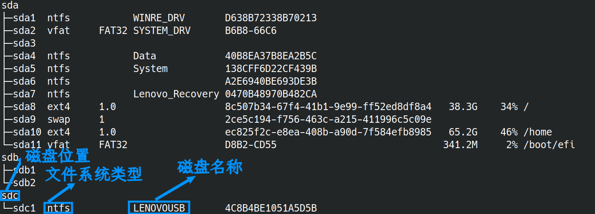
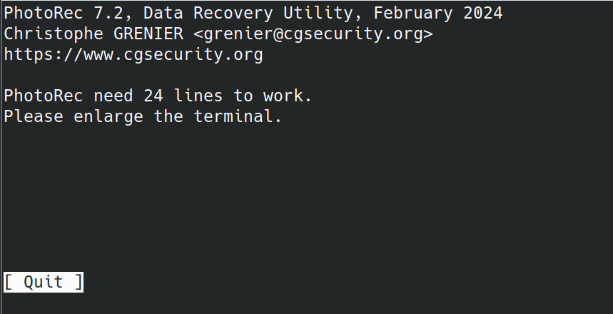
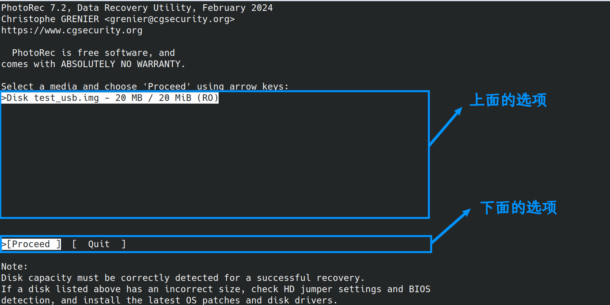
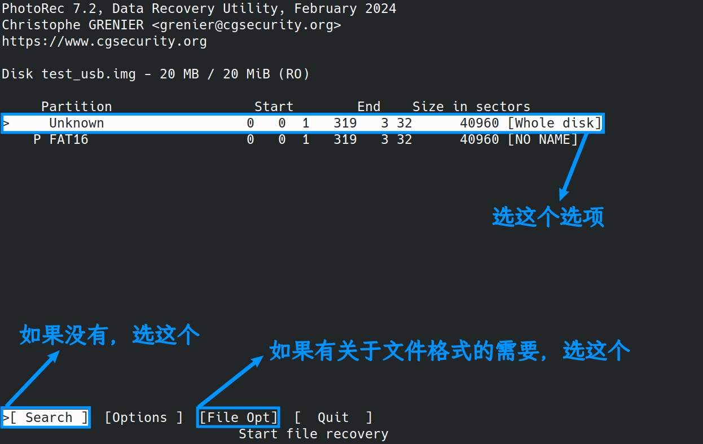
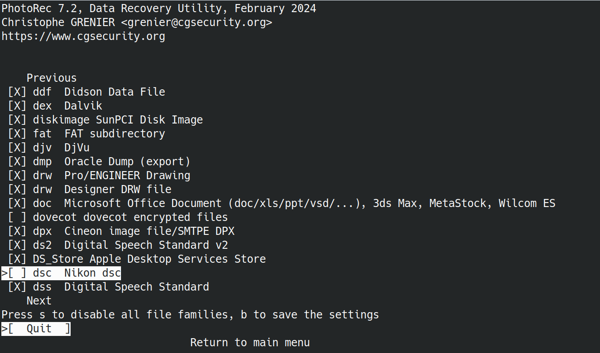
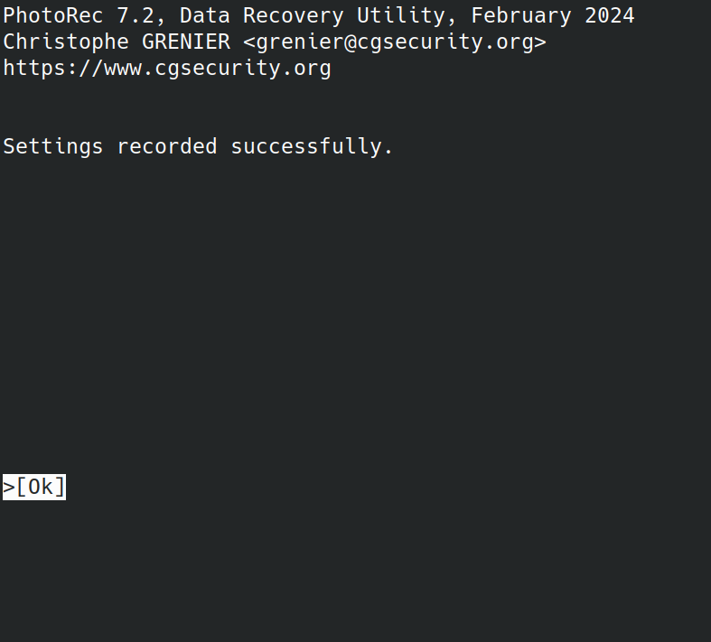
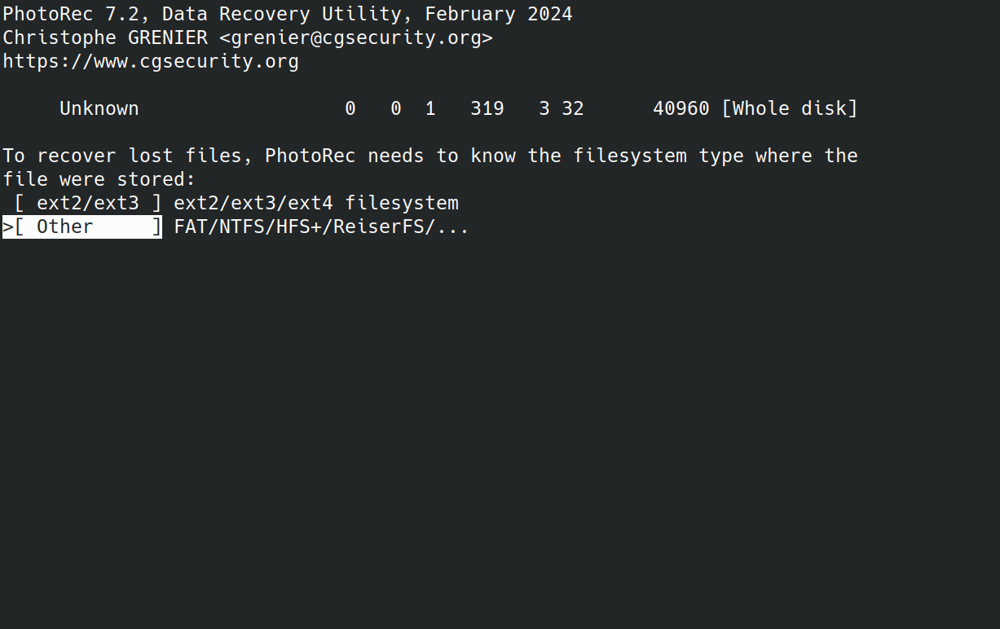
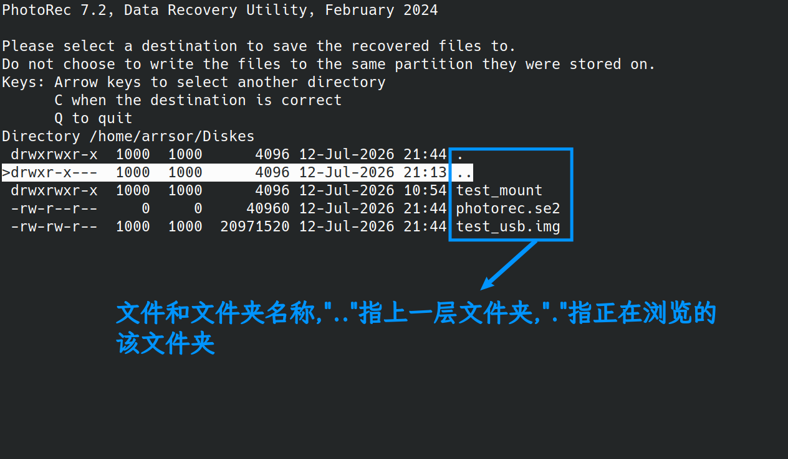
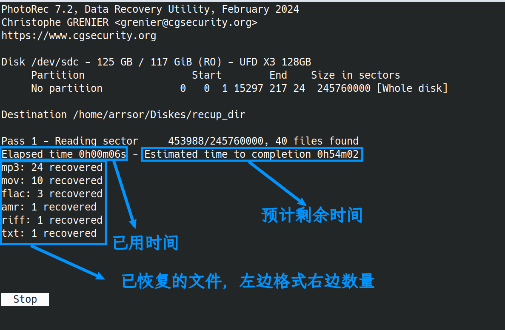
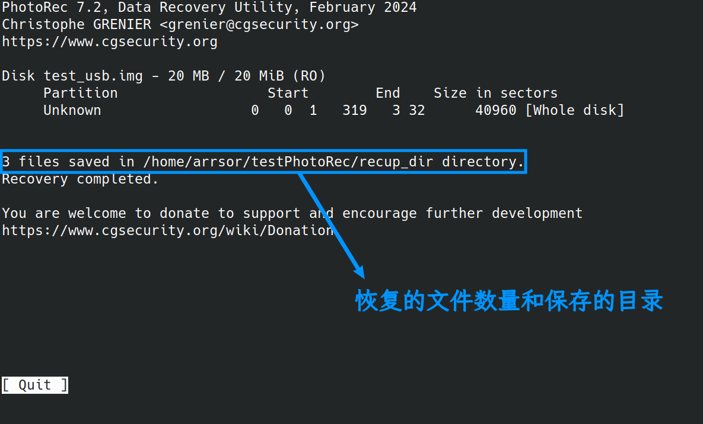

# 在Linux下使用PhotoRec恢复u盘数据教程
### 写在前面
在一次使用电脑时，因为误触，我一个不小心把U盘里所有文件删除了，所以正好趁这次机会，写一篇教程帮助和我一样不小心的人
本次教程使用软件PhotoRec，该软件能识别的文件有超过480种文件扩展名，涵盖了300个文件系列，比如JPEG,PNG,GIF,BMP,TIFF,RAW,PDF,DOC,DOCX,XLS,XLSX,PPT,PPTX,HTML,AVI,MOV,MP4,WMV,MP3,WMA,等等

但是PhotoRec**可能无法恢复全部文件**，且**文件名比较乱**(一般文件名会成f114514.xxx这种，文件名丢失，f后面的数字不一定)，需要你一个一个仔细查找，如果文件较多，这可能会极大地消磨你的耐心，所以你需要做好心理准备
### 一、发现误删，怎么处理U盘？
首先不要慌张，若U盘插在Linux上，若你有正在传输的文件，你需要先把正在传输的文件**立刻立刻立刻**取消传输，之后在终端中输入
```bash
lsblk -f
```
>说明：如果你看到文件系统类型那边是空的，说明你的U盘文件系统已经坏了，不过没关系，没了文件系统U盘文件照样能使用PhotoRec恢复文件(如果要恢复U盘文件系统，可以使用TestDisk，现在我挖个坑，在这个教程以后补上)，如果你不知道U盘文件类型，在PhotoRec第三屏幕选择文件系统类型时，可以先选[ Other ]，绝大多数U盘都是要选这个选项，如果恢复的文件大量是损坏的，就选择[ ext2/ext3 ]，不用担心选错，PhotoRec恢复时是不会向U盘里传输文件的，PhotoRec只读U盘

通过U盘的名称查看U盘的文件系统类型以及磁盘位置(图:lsblk -f输出图)



然后输入以下命令

```bash
sync
sudo umount /dev/sdX
```
> 这里的sdX改成U盘位置，注意，后面不带数字（比如截图中是sdc，你就写sudo umount /dev/sdc而不是sudo umount /dev/sdc1），如果下文中出现sdX一律按上面所说处理

如果失败怎么办？
先尝试关掉所有占用U盘的程序
```bash
sudo fuser -k /dev/sdX
```
再尝试
```bash
sync
sudo umount /dev/sdX
```
如果还是不行，就把电脑关机

如果你误删和恢复都是在同一个电脑上，且没有关机，就不要拔出U盘

如果你误删和恢复不再同一台**Linux电脑**上，或者是在电脑关机后，需要拔出U盘。当U盘被挂载时，也会被写入一些东西，可能覆盖被删除文件，所以我们要关闭自动挂载，在执行恢复操作的电脑上的终端中运行
(适用于GNOME桌面环境)
```bash
gsettings set org.gnome.desktop.media-handling automount false
gsettings set org.gnome.desktop.media-handling automount-open false
```
完成指令执行后插入U盘

在恢复完成之后，可以运行
```bash
gsettings set org.gnome.desktop.media-handling automount true
gsettings set org.gnome.desktop.media-handling automount-open true
```
来恢复原有设置
(适用于KDE桌面环境)
打开**系统设置**，搜索"自动挂载"，点进去，取消所有与“自动挂载”相关的选项
当恢复完成之后，可以将以上项目勾选
或者使用命令行
```bash
mkdir -p ~/.config
cat > ~/.config/kded_device_automounterrc << EOF
[General]
AutomountEnabled=false
EOF
```
完成指令执行后插入U盘

在恢复完成之后，可以运行
```bash
mkdir -p ~/.config
cat > ~/.config/kded_device_automounterrc << EOF
[General]
AutomountEnabled=true
EOF
```
>**说明：如果你发现U盘还是被挂载了怎么办？**
输入*lsblk -f*找到U盘位置后，输入*sudo umount /dev/sdX*

(选做，但做了更保险)
我们可以选择去做一个U盘备份，前提是，你要确定你的磁盘空间(或/home分区大小)要大于U盘的存储空间，这个备份要在**没有挂载**时做
```bash
sudo dd if=/dev/sdX of=/home/你的用户名/u盘备份.img bs=4M status=progress
```
这个命令中，"of="(**O**utput **F**ile,输出文件)后面可以改成其他路径(在/home分区不够大时),这是生成备份的位置，注意最后要写上文件名.img。"if="(**I**nput **F**ile，输入文件)后面的路径是被备份磁盘的位置

### 二、安装软件
要安装一个叫TestDisk的软件，安装并不复杂
先刷新一下
```bash
sudo apt update #适用于Debian/Ubuntu/Mint
sudo dnf check-update #适用于Fedora/RHEL/CentOS
sudo pacman -Syy #适用于Arch Linux/Manjaro
sudo apk update #适用于Alpine Linux
sudo emerge --sync #适用于Gentoo Linux
sudo zypper refresh #适用于openSUSE
```
安装软件本体，根据系统，选择命令
```bash
sudo apt install testdisk #适用于Debian/Ubuntu/Mint
sudo dnf install testdisk #适用于Fedora/RHEL/CentOS
sudo pacman -S testdisk #适用于Arch Linux/Manjaro
sudo apk add testdisk #适用于Alpine Linux
sudo emerge --ask app-admin/testdisk #适用于Gentoo Linux
sudo zypper install testdisk #适用于openSUSE
```

### 三、开始恢复数据
1. 把U盘插入电脑，但**不要挂载**，如果被自动挂载，那就**不要碰U盘里的文件**，如果提示要格式化，**千万千万别格式化**,这个问题可以用TestDisk来解决，但暂时先不用

2. 输入命令
```bash
sudo photorec /dev/sdX
```
>说明：此时的sdX应该替换为磁盘位置，比如上图中，U盘的磁盘位置是sdc,那就把sdX改成sdc,命令也就成了"sudo photorec /dev/sdc"

>如果我要用备份的.img文件怎么办？
>可以将该文件的绝对路径传入，比如"sudo photorec /path/to/xxx.img"


如果此时弹出



你就把终端窗口调大一些

3. 进入PhotoRec来恢复文件
打开后，这是你第一眼看到的界面(图:PhotoRec第一屏幕)

>说明：使用←和→按键可以在下面的的选项中选择，↑和↓按键可以在上面的选项中选择，Enter按键可以确定(接下来的场景都适用)

选择"[Proceed]"后按下Enter键，上面一般只有一个选项，不用管它

然后你会看到下一个界面(图:PhotoRec第二屏幕)

在上面的选项中，要选择后面带有[Whole disk]的选项
然后，在下面的选项中，你如果有关于要恢复的文件格式的需要，选[File Opt]后按下Enter键(图:PhotoRec文件格式选择界面)


>说明：
>- 通过↑和↓键来选择你需要的格式，按空格键勾选{当勾选时，最右边是[X],取消勾选时，最右边是[])你需要的格式
>- 如果需要全选或全不选，就按s(注意小写)

当选择完成后，按b来确认这些设置后，你会看到以 下界面(图:OK确认界面)


直接按选择[OK]后按Enter键即可

如果你选择完文件格式或不需要选择文件格式，在"图:PhotoRec第二屏幕"的界面中，选择[Search]后按下Enter键即可
之后你会看到这个页面(图:PhotoRec第三屏幕)

这里要选择U盘的文件系统类型，如果刚才在*lsblk -f*或记得自己的U盘文件系统类型是ext2/ext3/ext4的话，选择[ ext2/ext3 ]后按Enter键，如果不是，选择[ Other    ]后按Enter键

>如果你不知道U盘文件类型，在PhotoRec第三屏幕选择文件系统类型时，可以先选[ Other ]，绝大多数U盘都是要选这个选项，如果恢复的文件大量是损坏的，就选择[ ext2/ext3 ]，不用担心选错，PhotoRec恢复时是不会向U盘里传输文件的，PhotoRec只读U盘

完成后，你会看到这个界面(图:PhotoRec第四屏幕)

>说明：
>- 最右边是文件或文件夹名称
>- 使用↑和↓键选择目录，按Enter进入该文件夹
>- 其中".."指上一层文件夹,"."指正在浏览的该文件夹

**注意:** 选择恢复文件夹时，**一定要选择除了被恢复磁盘上的文件夹**，不然会导致PhotoRec恢复已经恢复的文件造成循环，占用磁盘空间，这里你就存在/home/用户名(这个用户名替换成你自己的)
之后，按"C"(注意大写)保存该设置

确认后，你会看到这样的界面(图:PhotoRec第五屏幕)

接下来，你要做的就是等待了（如果你不想恢复，选择[Stop]后按Enter即可）

等待完成，会有以下界面(图:PhotoRec第六屏幕)


选择[ Quit ]后按Enter,你的文件就恢复得差不多了
然后关闭终端窗口

你的文件会在你选择的目录下的叫"recup_dir.xx"(xx一般是数字)，恢复的文件都在那里
